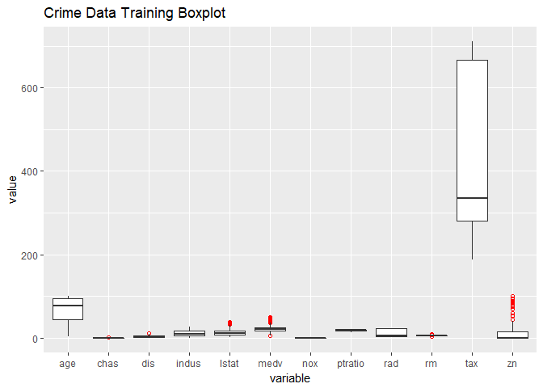
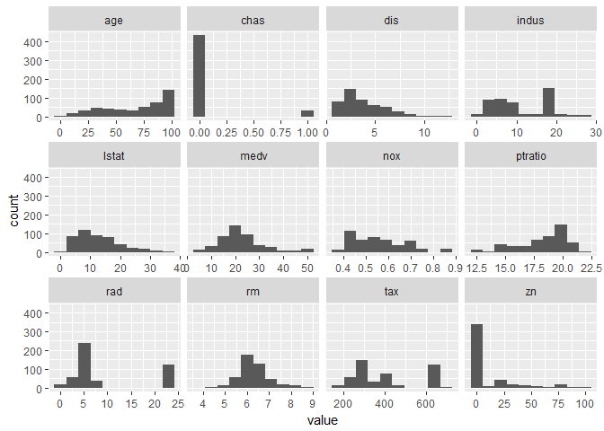
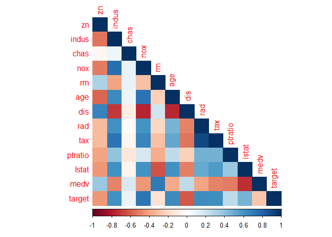
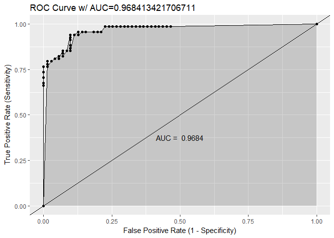
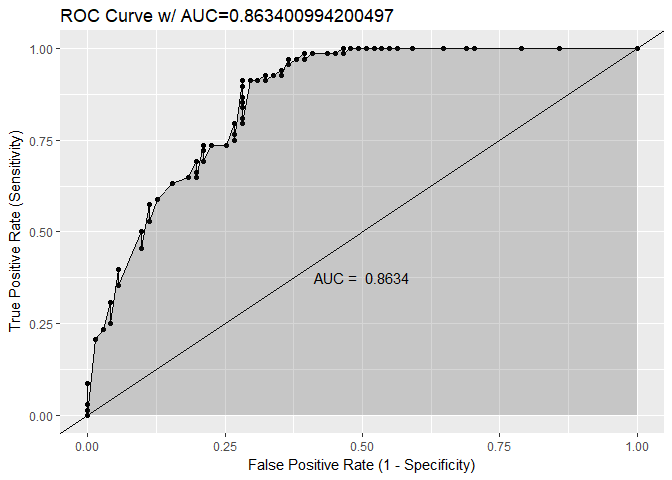

DATA 621 - Homework 3
================
Joshua Sturm
04/02/2018

Introduction
============

Your objective is to build a binary logistic regression model on the training data set to predict whether the neighbourhood will be at risk for high crime levels. You will provide classifications and probabilities for the evaluation data set using your binary logistic regression model. You can only use the variables given to you (or, variables that you derive from the variables provided).

1. Data Exploration
===================

1.1 Load Libraries
------------------

1.2 Read in data
----------------

### 1.2.1 Create data dictionary

1.3 Basic dataset statistics
----------------------------

The training data has 466 cases, with 13 predictor variables. Each case represents a neighbourhood in Boston. Our large sample size satisfies one of the requirements to fit our data to a logistic model.

Amazingly, there is not a single `NA` in the entire dataset, which will make our data cleaning job much easier!

1.4 Summary Graphs
------------------

### 1.4.1 Boxplot

Aside from `zn`, this dataset doesn't have too many outliers.

### 1.4.2 Histogram

We can see some variables, `age`, `chas`, `rad`, `zn`, in particular, are strongly skewed.

### 1.4.3 Correlation

#### 1.4.3.1 Correlation Heatmap

#### 1.4.3.2 Correlation (with response) table

From the above correlation analysis, it appears that `chas` is not correlated with neither the response variable, nor any of the other predictor variables. This is important to note, since we may consider removing it from the final model.

Another concern is the high correlation between `rad` and `tax` - a staggering 0.9064632! We may want to remove one of these predictors from our model to prevent muddying it with collinearity.

2. Data Preparation
===================

2.1 Missing Data
----------------

As noted earlier, the dataset is remarkably whole, so we may proceed without worrying about having to imputate any data.

2.2 Normality of Predictor Variables
------------------------------------

As can be seen in the distribution plots in [section 1.4.2](#histogram), many of the predictor variables are not normally distributed. However, since logistic regression makes no assumptions, including the normality of the variables, we can safely skip this step, and keep the variables as they are.

2.3 Add or Remove Variables
---------------------------

As mentioned before, we'll consider removing two variables for one of our models. `chas`, due to it's low correlation with any of the other variables, and either `rad` or `tax`, due to high collinearity between the two. Since `rad` has a higher correlation with the `target` variable tham `tax` does, we'll drop the latter from one of our models.

Other than the variables mentioned above, I don't see any reason to remove any variables. Furthermore, there isn't enough implicit information from which we could possibly derive new variables.

2.4 Variable Transformation
---------------------------

339 of 466 cases in the `zn` variable have a value of 0, or roughly 72.75%. We may want to convert this to a binary variable, where

$$ zn = 
\\begin{cases} 
      0 & zn = 0 \\\\
      1 & zn \\neq 0
\\end{cases}
$$

Additionally, we'll convert both the `target` variable, as well as `chas`, from integers to factors.

2.5 Outliers
------------

I believe that once we recode the variable `zn` as outlined in [section 2.4](#variable-transformation), we will no longer have the outlier issue that is currently affecting the predictor.

3. Build Models
===============

Note that I will not be using any sort of 'automatic' model selection, e.g. stepwise regression. After reading [this article](https://www.stata.com/support/faqs/statistics/stepwise-regression-problems/), I've decided to forego any automated choosing, and build (and test) the models myself.

3.1 Model 1
-----------

My first model will use the original dataset as is, without any variable changes. This will serve as a sort of benchmark with which to gauge the effectiveness of our changes.

    ## 
    ## Call:
    ## glm(formula = target ~ ., family = binomial(link = "logit"), 
    ##     data = crime.training)
    ## 
    ## Deviance Residuals: 
    ##     Min       1Q   Median       3Q      Max  
    ## -1.8464  -0.1445  -0.0017   0.0029   3.4665  
    ## 
    ## Coefficients:
    ##               Estimate Std. Error z value Pr(>|z|)    
    ## (Intercept) -40.822934   6.632913  -6.155 7.53e-10 ***
    ## zn           -0.065946   0.034656  -1.903  0.05706 .  
    ## indus        -0.064614   0.047622  -1.357  0.17485    
    ## chas1         0.910765   0.755546   1.205  0.22803    
    ## nox          49.122297   7.931706   6.193 5.90e-10 ***
    ## rm           -0.587488   0.722847  -0.813  0.41637    
    ## age           0.034189   0.013814   2.475  0.01333 *  
    ## dis           0.738660   0.230275   3.208  0.00134 ** 
    ## rad           0.666366   0.163152   4.084 4.42e-05 ***
    ## tax          -0.006171   0.002955  -2.089  0.03674 *  
    ## ptratio       0.402566   0.126627   3.179  0.00148 ** 
    ## lstat         0.045869   0.054049   0.849  0.39608    
    ## medv          0.180824   0.068294   2.648  0.00810 ** 
    ## ---
    ## Signif. codes:  0 '***' 0.001 '**' 0.01 '*' 0.05 '.' 0.1 ' ' 1
    ## 
    ## (Dispersion parameter for binomial family taken to be 1)
    ## 
    ##     Null deviance: 645.88  on 465  degrees of freedom
    ## Residual deviance: 192.05  on 453  degrees of freedom
    ## AIC: 218.05
    ## 
    ## Number of Fisher Scoring iterations: 9

### 3.1.1 Model 1 Interpretation

There are several variables that are not significant to the model (i.e. *P* &gt; 0.05), including `indus`, `chas`, `rm`, `lstat`, with `zn` right on the border of 0.05.

`zn`, `indus`, `rm`, and `tax` are all negatively correlated to the `target` variable, meaning an increase in any of these is correlated with a lower occurence of crime.

The model has an AIC (Akaike information criterion) of 218.05, and a BIC (Bayesian information criterion) of 271.92.

With a Null deviance of 645.88, and a Residual deviance of 192.05, we get a difference of 453.83.

Lastly, let's run an ANOVA Chi-Square test to view the effect each predictor variable is having on the response variable.

    ## Analysis of Deviance Table
    ## 
    ## Model: binomial, link: logit
    ## 
    ## Response: target
    ## 
    ## Terms added sequentially (first to last)
    ## 
    ## 
    ##         Df Deviance Resid. Df Resid. Dev  Pr(>Chi)    
    ## NULL                      465     645.88              
    ## zn       1  127.411       464     518.46 < 2.2e-16 ***
    ## indus    1   86.433       463     432.03 < 2.2e-16 ***
    ## chas     1    1.274       462     430.76  0.258981    
    ## nox      1  150.804       461     279.95 < 2.2e-16 ***
    ## rm       1    6.755       460     273.20  0.009349 ** 
    ## age      1    0.217       459     272.98  0.641515    
    ## dis      1    7.981       458     265.00  0.004727 ** 
    ## rad      1   53.018       457     211.98 3.305e-13 ***
    ## tax      1    5.562       456     206.42  0.018355 *  
    ## ptratio  1    5.657       455     200.76  0.017388 *  
    ## lstat    1    0.814       454     199.95  0.366872    
    ## medv     1    7.904       453     192.05  0.004933 ** 
    ## ---
    ## Signif. codes:  0 '***' 0.001 '**' 0.01 '*' 0.05 '.' 0.1 ' ' 1

3.2 Model 2
-----------

For our second model, we'll remove the variables deemed insignificant in model 1.

    ## 
    ## Call:
    ## glm(formula = target ~ . - indus - chas - rm - lstat, family = binomial(link = "logit"), 
    ##     data = crime.training)
    ## 
    ## Deviance Residuals: 
    ##     Min       1Q   Median       3Q      Max  
    ## -1.8295  -0.1752  -0.0021   0.0032   3.4191  
    ## 
    ## Coefficients:
    ##               Estimate Std. Error z value Pr(>|z|)    
    ## (Intercept) -37.415922   6.035013  -6.200 5.65e-10 ***
    ## zn           -0.068648   0.032019  -2.144  0.03203 *  
    ## nox          42.807768   6.678692   6.410 1.46e-10 ***
    ## age           0.032950   0.010951   3.009  0.00262 ** 
    ## dis           0.654896   0.214050   3.060  0.00222 ** 
    ## rad           0.725109   0.149788   4.841 1.29e-06 ***
    ## tax          -0.007756   0.002653  -2.924  0.00346 ** 
    ## ptratio       0.323628   0.111390   2.905  0.00367 ** 
    ## medv          0.110472   0.035445   3.117  0.00183 ** 
    ## ---
    ## Signif. codes:  0 '***' 0.001 '**' 0.01 '*' 0.05 '.' 0.1 ' ' 1
    ## 
    ## (Dispersion parameter for binomial family taken to be 1)
    ## 
    ##     Null deviance: 645.88  on 465  degrees of freedom
    ## Residual deviance: 197.32  on 457  degrees of freedom
    ## AIC: 215.32
    ## 
    ## Number of Fisher Scoring iterations: 9

### 3.2.1 Model 2 Interpretation

This model has an AIC of 215.32, and a BIC of 252.62.

With a Null deviance of 645.88, and a Residual deviance of 197.32, we get a difference of 448.55.

Once again, we'll run an ANOVA Chi-Square test on this model.

    ## Analysis of Deviance Table
    ## 
    ## Model: binomial, link: logit
    ## 
    ## Response: target
    ## 
    ## Terms added sequentially (first to last)
    ## 
    ## 
    ##         Df Deviance Resid. Df Resid. Dev  Pr(>Chi)    
    ## NULL                      465     645.88              
    ## zn       1  127.411       464     518.46 < 2.2e-16 ***
    ## nox      1  230.177       463     288.29 < 2.2e-16 ***
    ## age      1    0.767       462     287.52 0.3810001    
    ## dis      1    4.296       461     283.22 0.0382133 *  
    ## rad      1   55.953       460     227.27 7.423e-14 ***
    ## tax      1   15.916       459     211.35 6.620e-05 ***
    ## ptratio  1    2.706       458     208.65 0.0999454 .  
    ## medv     1   11.326       457     197.32 0.0007644 ***
    ## ---
    ## Signif. codes:  0 '***' 0.001 '**' 0.01 '*' 0.05 '.' 0.1 ' ' 1

This model has a smaller difference between deviances, but has a slightly lower AIC.

3.3 Model 3
-----------

For the last model, we'll transform `zn` to a binary variable, and remove `tax`.

    ## 
    ## Call:
    ## glm(formula = target ~ ., family = binomial(link = "logit"), 
    ##     data = crime.training.copy)
    ## 
    ## Deviance Residuals: 
    ##     Min       1Q   Median       3Q      Max  
    ## -1.8183  -0.2692  -0.0246   0.0056   3.5957  
    ## 
    ## Coefficients:
    ##              Estimate Std. Error z value Pr(>|z|)    
    ## (Intercept) -36.12048    5.64824  -6.395 1.61e-10 ***
    ## zn1          -1.92296    0.72029  -2.670  0.00759 ** 
    ## nox          39.09282    6.18533   6.320 2.61e-10 ***
    ## age           0.03325    0.01079   3.083  0.00205 ** 
    ## dis           0.79502    0.20878   3.808  0.00014 ***
    ## rad           0.54136    0.12349   4.384 1.17e-05 ***
    ## ptratio       0.21768    0.11254   1.934  0.05308 .  
    ## medv          0.13494    0.03385   3.986 6.72e-05 ***
    ## ---
    ## Signif. codes:  0 '***' 0.001 '**' 0.01 '*' 0.05 '.' 0.1 ' ' 1
    ## 
    ## (Dispersion parameter for binomial family taken to be 1)
    ## 
    ##     Null deviance: 645.88  on 465  degrees of freedom
    ## Residual deviance: 208.21  on 458  degrees of freedom
    ## AIC: 224.21
    ## 
    ## Number of Fisher Scoring iterations: 8

4. Select Model
===============

    ## Analysis of Deviance Table
    ## 
    ## Model 1: target ~ zn + indus + chas + nox + rm + age + dis + rad + tax + 
    ##     ptratio + lstat + medv
    ## Model 2: target ~ (zn + indus + chas + nox + rm + age + dis + rad + tax + 
    ##     ptratio + lstat + medv) - indus - chas - rm - lstat
    ## Model 3: target ~ zn + nox + age + dis + rad + ptratio + medv
    ##   Resid. Df Resid. Dev Df Deviance  Pr(>Chi)    
    ## 1       453     192.05                          
    ## 2       457     197.32 -4  -5.2759 0.2601382    
    ## 3       458     208.21 -1 -10.8836 0.0009702 ***
    ## ---
    ## Signif. codes:  0 '***' 0.001 '**' 0.01 '*' 0.05 '.' 0.1 ' ' 1

The anova test tells us that there's good reason to use model two instead of the others.

Interestingly, the third model is the worst of the three, even with the modified variables.

To aid in model selection, I'll split training data into two partitions, use all three models to make predictions, and evaluate each based on several criteria.

Using the following formulas:

We'll compare the results of all three models.

Roc Curve for Model 1

    ## [[1]]

Roc Curve for Model 2

    ## [[1]]

Roc Curve for Model 3

    ## [[1]]

Surprisingly, model 1 and model 2 are very close, with each performing better in different categories (model 3 is not even close). However, I will pick model 2 as my final choice, due to the possibly overfitting of model 1 as a result of wrongly coded variables, as well as collinearity between some of the predictors.

Let's now use model 2 to predict on a new set of data.

References
==========

-   <http://userwww.sfsu.edu/efc/classes/biol710/logistic/logisticreg.htm>
-   <https://www.hackerearth.com/practice/machine-learning/machine-learning-algorithms/logistic-regression-analysis-r/tutorial/>
-   <https://stats.stackexchange.com/questions/59879/logistic-regression-anova-chi-square-test-vs-significance-of-coefficients-ano>
-   <https://www.machinelearningplus.com/machine-learning/logistic-regression-tutorial-examples-r/>
