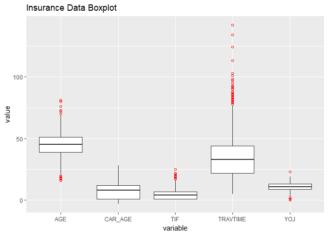
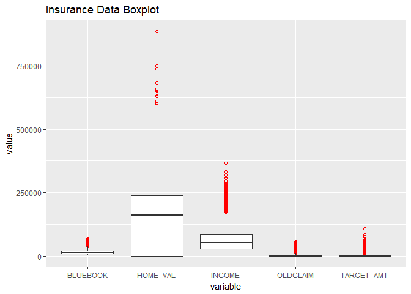
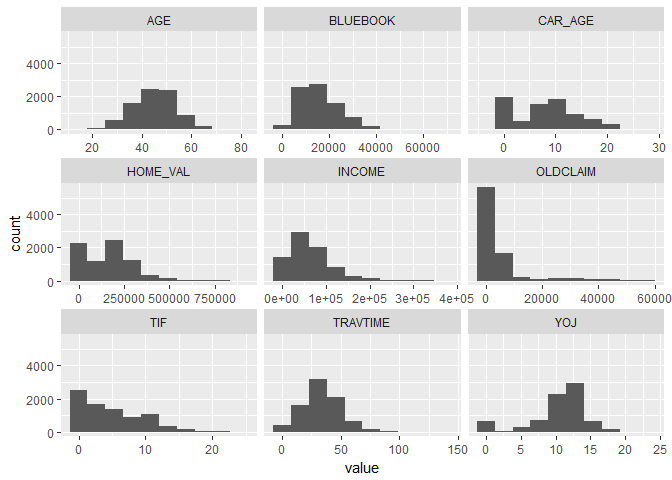
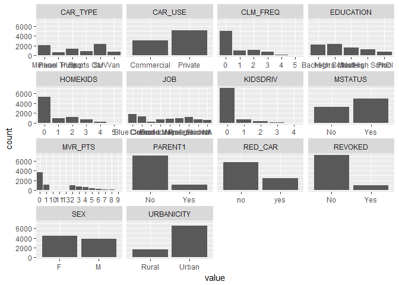
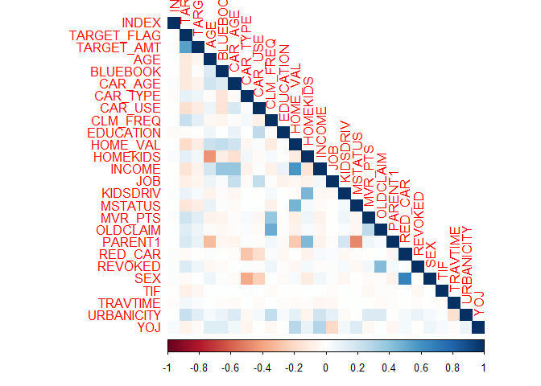
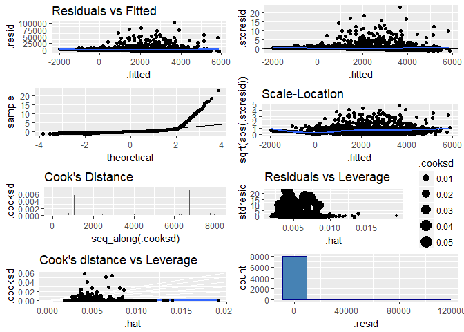

DATA 621 - Discussion 11
================
Joshua Sturm
04/19/2018

Objective
=========

Your objective is to build multiple linear regression and binary logistic regression models on the training data to predict the probability that a person will crash their car and also the amount of money it will cost if the person does crash their car. You can only use the variables given to you (or variables that you derive from the variables provided).

1. Data Exploration
===================

1.1 Import Dataset
------------------

### 1.1.1 Data Dictionary

1.2 Data Structure
------------------

The dataset has 23 predictor variables, and 8161 cases. Each case represents an automotive insurance policy holder. We have a sufficiently large sample size to perform regression analysis on the data.

### 1.2.1 Missing Data

    ##       INDEX TARGET_FLAG  TARGET_AMT         AGE    BLUEBOOK     CAR_AGE 
    ##           0           0           0           6           0         510 
    ##    CAR_TYPE     CAR_USE    CLM_FREQ   EDUCATION    HOME_VAL    HOMEKIDS 
    ##           0           0           0           0         464           0 
    ##      INCOME         JOB    KIDSDRIV     MSTATUS     MVR_PTS    OLDCLAIM 
    ##         445         526           0           0           0           0 
    ##     PARENT1     RED_CAR     REVOKED         SEX         TIF    TRAVTIME 
    ##           0           0           0           0           0           0 
    ##  URBANICITY         YOJ 
    ##           0         454

There are several variables that have missing data: `age`, `yoj`, `income`, `home_val`, `job`, and `car_age`. When looking at the data dictionary for the defintions of these variables, it seems that each of these variables are independent of each other. For example, some cases have `yoj` missing, but may have values for `job` or `income`. This leads me to believe that the missing data is missing at random. Therefore, I will not remove these cases, but instead try to use some form of imputation.

    ## Observations: 8,161
    ## Variables: 26
    ## $ INDEX       <int> 1, 2, 4, 5, 6, 7, 8, 11, 12, 13, 14, 15, 16, 17, 1...
    ## $ TARGET_FLAG <int> 0, 0, 0, 0, 0, 1, 0, 1, 1, 0, 1, 0, 0, 1, 1, 0, 0,...
    ## $ TARGET_AMT  <dbl> 0.000, 0.000, 0.000, 0.000, 0.000, 2946.000, 0.000...
    ## $ AGE         <int> 60, 43, 35, 51, 50, 34, 54, 37, 34, 50, 53, 43, 55...
    ## $ BLUEBOOK    <fct> $14,230, $14,940, $4,010, $15,440, $18,000, $17,43...
    ## $ CAR_AGE     <int> 18, 1, 10, 6, 17, 7, 1, 7, 1, 17, 11, 1, 9, 10, 5,...
    ## $ CAR_TYPE    <fct> Minivan, Minivan, z_SUV, Minivan, z_SUV, Sports Ca...
    ## $ CAR_USE     <fct> Private, Commercial, Private, Private, Private, Co...
    ## $ CLM_FREQ    <int> 2, 0, 2, 0, 2, 0, 0, 1, 0, 0, 0, 0, 2, 0, 0, 0, 0,...
    ## $ EDUCATION   <fct> PhD, z_High School, z_High School, <High School, P...
    ## $ HOME_VAL    <fct> $0, $257,252, $124,191, $306,251, $243,925, $0, NA...
    ## $ HOMEKIDS    <int> 0, 0, 1, 0, 0, 1, 0, 2, 0, 0, 0, 0, 0, 0, 0, 3, 0,...
    ## $ INCOME      <fct> $67,349, $91,449, $16,039, NA, $114,986, $125,301,...
    ## $ JOB         <fct> Professional, z_Blue Collar, Clerical, z_Blue Coll...
    ## $ KIDSDRIV    <int> 0, 0, 0, 0, 0, 0, 0, 1, 0, 0, 0, 0, 0, 0, 0, 0, 0,...
    ## $ MSTATUS     <fct> z_No, z_No, Yes, Yes, Yes, z_No, Yes, Yes, z_No, z...
    ## $ MVR_PTS     <int> 3, 0, 3, 0, 3, 0, 0, 10, 0, 1, 0, 0, 3, 3, 3, 0, 0...
    ## $ OLDCLAIM    <fct> $4,461, $0, $38,690, $0, $19,217, $0, $0, $2,374, ...
    ## $ PARENT1     <fct> No, No, No, No, No, Yes, No, No, No, No, No, No, N...
    ## $ RED_CAR     <fct> yes, yes, no, yes, no, no, no, yes, no, no, no, no...
    ## $ REVOKED     <fct> No, No, No, No, Yes, No, No, Yes, No, No, No, No, ...
    ## $ SEX         <fct> M, M, z_F, M, z_F, z_F, z_F, M, z_F, M, z_F, z_F, ...
    ## $ TIF         <int> 11, 1, 4, 7, 1, 1, 1, 1, 1, 7, 1, 7, 7, 6, 1, 6, 6...
    ## $ TRAVTIME    <int> 14, 22, 5, 32, 36, 46, 33, 44, 34, 48, 15, 36, 25,...
    ## $ URBANICITY  <fct> Highly Urban/ Urban, Highly Urban/ Urban, Highly U...
    ## $ YOJ         <int> 11, 11, 10, 14, NA, 12, NA, NA, 10, 7, 14, 5, 11, ...

At this point, I usually plot some graphs to better understand the data, but this dataset is somewhat "dirty", and requires tidying before visualizing it. For this reason, I will include the graphs after cleaning, which will be done in section 2.

2. Data Preparation
===================

As can be seen above, the `$` character is causing R to classify what should be numeric columns as characters (and thus factors). I'll remove all instances of the `$` character, as well as the unnecessary "z\_" found in man variables, through the use of regular expressions.

2.1 Remove Extraneous Characters
--------------------------------

2.2 Rename Values
-----------------

2.3 Recode Variables
--------------------

2.4 Data Visualizations
-----------------------

### 2.4.1 Boxplot

### 2.4.2 Histogram

From the boxplot and histogram charts, it is much clearer that several variables are (usally positively) skewed.

`Age`, `TIF`, `TRAVTIME`, `YOJ`, `HOME_VAL`, `INCOME`, and `OLDCLAIM` all have outliers, and are thus strongly skewed.

### 2.4.3 Bar Chart

### 2.5 Correlation

#### 2.5.1 Correlation Heatmap

#### 2.5.2 Correlation (with dependent) tables

From the correlation chart and tables, there don't seem to be any variables correlated one or another with either response variable. However, there do appear to be several variables related to one another, although not to the point of extreme collinearity.

`OLDCLAIM` and `CLM_FREQ` have a pearson correlation of 0.4950519. This makes sense, since `OLDCLAIM` will only have a value if `CLM_FREQ` ≠0.

`INCOME` and `HOME_VAL` have a pearson correlation of 0.5817192, which is reasonable - a person with a higher salary can afford a more expensive home, or a home in a more expensive location.

Other correlated variables include: - `RED_CAR` and `SEX` - `PARENT1` and `HOMEKIDS` - `MSTATUS` and `HOME_VAL`

### 2.6 Handling Missing Data

As noted earlier in [Section 1.2.1](#missing-data), there are several variables with a significant number of missing cases. I'll break it down by variable, and explain how I will imputate each.

#### 2.6.1 AGE

Each policy holder obviously has an age, and it's most likely required to be given to the insurer, so this is most likely an error in recording the data. Since there are so few missing cases, and the variable is nearly normal, I will impute using the median.

#### 2.6.2 CAR\_AGE

Much like the policy holder, ever car also has an age. Since there are so many missing cases, imputation will be done together with the other variables via a non-parametric random forest method.

#### 2.6.3 HOME\_VAL

There are 464 NA's for this variable. This could be due to recording errors, or possibly they're equivalent to a 0, meaning the policy holder doesn't own the home in which they're living. I'll try two different methods: one where the NA's are converted to a 0, and one imputed via random forest.

#### 2.6.4 INCOME

This variable has 445 missing cases. Since credit history is an important factor in insurance premiums, it's likely that income is required to be declared when creating a new policy. Therefore, like the other variables, the missing cases could either be due to recording errors, or simply meant to indicate the applicant had no income. Like `HOME_VAL`, I'll use two different methods to use in separate models.

#### 2.6.5 JOB

This variable could be missing cases due to the policy holder being unemployed, or didn't specify their job industry. Imputation will be handled by the random forest method.

#### 2.6.6 YOJ

There are fewer missing values for `YOJ` than `JOB`, but this could be explained by the number of 0 values for `YOJ`, which could possibly indicate unemployment. Data will be imputated along with the others via the random forest algorithm.

The algorithm had an error rate of for continuous variables, and for categorical ones.

### 2.7 Variable Transformation

Some of the predictor variables are strongly skewed, and so it may make sense to either transform them in some way, or simply recode them as binary variables.

#### 2.7.1 CAR\_AGE

Firstly, there is a negative value for one of the policy holders, which is obviously impossible, so I'll assume it was a typographical error, and use the absolute value, i.e. 3.

Since the majority of cars are ≤1 year old, I'll recode this to a binary named `NEW_CAR`, with any car ≥1 = 0.

#### 2.7.2 Remaining Variables

The remaining variables with high outliers seem to have reasonable skew. That is to say, that they're most likely not mistakes in the data, just extreme cases. In light of this, I will choose to not remove them, as they may contain information I would not want to lose.

3. Build Models
===============

3.1 Logistic model
------------------

### 3.1.2 Logistic Model One

For the first model, I will use the original dataset, with only the essential transformations, to use as a baseline with which to compare my other (modified) datasets.

    ## 
    ## Call:
    ## glm(formula = TARGET_FLAG ~ . - INDEX - TARGET_AMT, family = binomial(link = "logit"), 
    ##     data = ins.training)
    ## 
    ## Deviance Residuals: 
    ##     Min       1Q   Median       3Q      Max  
    ## -2.5837  -0.7001  -0.3848   0.6185   3.1742  
    ## 
    ## Coefficients:
    ##                           Estimate Std. Error z value Pr(>|z|)    
    ## (Intercept)             -3.027e+00  3.383e-01  -8.950  < 2e-16 ***
    ## AGE                     -4.228e-05  4.879e-03  -0.009 0.993086    
    ## BLUEBOOK                -2.238e-05  6.134e-06  -3.649 0.000264 ***
    ## CAR_AGE                 -3.243e-03  8.969e-03  -0.362 0.717631    
    ## CAR_TYPEPanel Truck      6.664e-01  1.961e-01   3.398 0.000678 ***
    ## CAR_TYPEPickup           5.357e-01  1.161e-01   4.613 3.97e-06 ***
    ## CAR_TYPESports Car       1.109e+00  1.474e-01   7.519 5.50e-14 ***
    ## CAR_TYPESUV              8.263e-01  1.265e-01   6.530 6.56e-11 ***
    ## CAR_TYPEVan              5.451e-01  1.508e-01   3.614 0.000302 ***
    ## CAR_USEPrivate          -8.222e-01  1.067e-01  -7.708 1.27e-14 ***
    ## CLM_FREQ1                5.847e-01  1.185e-01   4.935 8.00e-07 ***
    ## CLM_FREQ2                6.538e-01  1.109e-01   5.898 3.68e-09 ***
    ## CLM_FREQ3                6.539e-01  1.251e-01   5.228 1.71e-07 ***
    ## CLM_FREQ4                8.441e-01  2.058e-01   4.101 4.12e-05 ***
    ## CLM_FREQ5                6.065e-01  7.261e-01   0.835 0.403607    
    ## EDUCATIONHigh School     3.775e-01  1.040e-01   3.629 0.000285 ***
    ## EDUCATIONMasters        -6.308e-02  1.687e-01  -0.374 0.708534    
    ## EDUCATIONNo High School  3.925e-01  1.333e-01   2.944 0.003239 ** 
    ## EDUCATIONPhD             4.865e-01  2.262e-01   2.151 0.031498 *  
    ## HOME_VAL                -1.360e-06  4.314e-07  -3.152 0.001620 ** 
    ## HOMEKIDS1                3.842e-01  1.382e-01   2.779 0.005449 ** 
    ## HOMEKIDS2                2.873e-01  1.361e-01   2.111 0.034811 *  
    ## HOMEKIDS3                1.222e-01  1.588e-01   0.769 0.441636    
    ## HOMEKIDS4                3.910e-02  2.479e-01   0.158 0.874665    
    ## HOMEKIDS5                4.410e-01  7.538e-01   0.585 0.558557    
    ## INCOME                  -3.426e-06  1.444e-06  -2.373 0.017661 *  
    ## JOBClerical              1.825e-01  1.211e-01   1.506 0.131953    
    ## JOBDoctor               -7.250e-01  3.307e-01  -2.192 0.028365 *  
    ## JOBHome Maker           -1.447e-01  1.792e-01  -0.808 0.419345    
    ## JOBLawyer                1.769e-02  2.166e-01   0.082 0.934912    
    ## JOBManager              -8.905e-01  1.615e-01  -5.513 3.53e-08 ***
    ## JOBProfessional         -9.148e-02  1.377e-01  -0.664 0.506598    
    ## JOBStudent              -1.746e-01  1.543e-01  -1.131 0.257942    
    ## KIDSDRIV1                2.849e-01  1.342e-01   2.123 0.033770 *  
    ## KIDSDRIV2                6.803e-01  1.905e-01   3.572 0.000355 ***
    ## KIDSDRIV3                8.316e-01  3.524e-01   2.360 0.018294 *  
    ## KIDSDRIV4               -1.278e+01  3.194e+02  -0.040 0.968089    
    ## MSTATUSYes              -5.118e-01  1.051e-01  -4.870 1.12e-06 ***
    ## MVR_PTS1                 8.775e-02  1.073e-01   0.818 0.413286    
    ## MVR_PTS10                1.015e+00  8.453e-01   1.200 0.229969    
    ## MVR_PTS11                2.052e+00  1.071e+00   1.917 0.055300 .  
    ## MVR_PTS13                1.445e+01  3.384e+02   0.043 0.965944    
    ## MVR_PTS2                 2.633e-01  1.122e-01   2.347 0.018930 *  
    ## MVR_PTS3                 3.777e-01  1.209e-01   3.124 0.001785 ** 
    ## MVR_PTS4                 2.834e-01  1.310e-01   2.163 0.030573 *  
    ## MVR_PTS5                 1.896e-01  1.518e-01   1.249 0.211826    
    ## MVR_PTS6                 3.745e-01  1.803e-01   2.077 0.037827 *  
    ## MVR_PTS7                 8.102e-01  2.103e-01   3.852 0.000117 ***
    ## MVR_PTS8                 1.358e+00  3.404e-01   3.989 6.64e-05 ***
    ## MVR_PTS9                 1.327e+00  4.009e-01   3.310 0.000935 ***
    ## OLDCLAIM                -1.919e-05  4.927e-06  -3.895 9.82e-05 ***
    ## PARENT1Yes               2.257e-01  1.412e-01   1.599 0.109816    
    ## RED_CARyes              -2.074e-01  1.040e-01  -1.994 0.046133 *  
    ## REVOKEDYes               9.154e-01  1.094e-01   8.369  < 2e-16 ***
    ## SEXM                     2.206e-01  1.296e-01   1.702 0.088753 .  
    ## TIF                     -5.243e-02  8.608e-03  -6.091 1.12e-09 ***
    ## TRAVTIME                 1.609e-02  2.208e-03   7.288 3.15e-13 ***
    ## URBANICITYUrban          2.272e+00  1.257e-01  18.078  < 2e-16 ***
    ## YOJ                     -9.647e-03  9.842e-03  -0.980 0.326969    
    ## ---
    ## Signif. codes:  0 '***' 0.001 '**' 0.01 '*' 0.05 '.' 0.1 ' ' 1
    ## 
    ## (Dispersion parameter for binomial family taken to be 1)
    ## 
    ##     Null deviance: 6990.9  on 6044  degrees of freedom
    ## Residual deviance: 5319.8  on 5986  degrees of freedom
    ##   (2116 observations deleted due to missingness)
    ## AIC: 5437.8
    ## 
    ## Number of Fisher Scoring iterations: 12

#### 3.1.2.1 Logistic Model 1 Interpretation

The model suggest there are many variables that are not significantly contributing toward predicting the target variable.

The model has an AIC (Akaike information criterion) of 5437.85, and a BIC (Bayesian information criterion) of 5833.56.

With a Null deviance of 6990.86, and a Residual deviance of 5319.85, we get a difference of 1671.01.

Lastly, let's run an ANOVA Chi-Square test to view the effect each predictor variable is having on the response variable.

    ## Analysis of Deviance Table
    ## 
    ## Model: binomial, link: logit
    ## 
    ## Response: TARGET_FLAG
    ## 
    ## Terms added sequentially (first to last)
    ## 
    ## 
    ##            Df Deviance Resid. Df Resid. Dev  Pr(>Chi)    
    ## NULL                        6044     6990.9              
    ## AGE         1    80.88      6043     6910.0 < 2.2e-16 ***
    ## BLUEBOOK    1    56.93      6042     6853.0 4.510e-14 ***
    ## CAR_AGE     1    39.66      6041     6813.4 3.018e-10 ***
    ## CAR_TYPE    5   131.28      6036     6682.1 < 2.2e-16 ***
    ## CAR_USE     1   120.41      6035     6561.7 < 2.2e-16 ***
    ## CLM_FREQ    5   311.78      6030     6249.9 < 2.2e-16 ***
    ## EDUCATION   4    31.85      6026     6218.1 2.055e-06 ***
    ## HOME_VAL    1    78.13      6025     6139.9 < 2.2e-16 ***
    ## HOMEKIDS    5    34.12      6020     6105.8 2.258e-06 ***
    ## INCOME      1     0.02      6019     6105.8  0.900818    
    ## JOB         7    50.17      6012     6055.6 1.335e-08 ***
    ## KIDSDRIV    4    17.45      6008     6038.2  0.001578 ** 
    ## MSTATUS     1    37.70      6007     6000.5 8.253e-10 ***
    ## MVR_PTS    12    71.22      5995     5929.3 1.889e-10 ***
    ## OLDCLAIM    1     0.04      5994     5929.2  0.851480    
    ## PARENT1     1     4.36      5993     5924.9  0.036816 *  
    ## RED_CAR     1     1.27      5992     5923.6  0.260021    
    ## REVOKED     1   100.09      5991     5823.5 < 2.2e-16 ***
    ## SEX         1     3.25      5990     5820.3  0.071491 .  
    ## TIF         1    33.46      5989     5786.8 7.268e-09 ***
    ## TRAVTIME    1    16.64      5988     5770.2 4.521e-05 ***
    ## URBANICITY  1   449.35      5987     5320.8 < 2.2e-16 ***
    ## YOJ         1     0.96      5986     5319.8  0.327035    
    ## ---
    ## Signif. codes:  0 '***' 0.001 '**' 0.01 '*' 0.05 '.' 0.1 ' ' 1

### 3.1.3 Logistic Model Two

The second model will be using the dataset that was imputated with zeros.

    ## 
    ## Call:
    ## glm(formula = TARGET_FLAG ~ . - TARGET_AMT, family = binomial(link = "logit"), 
    ##     data = insz)
    ## 
    ## Deviance Residuals: 
    ##     Min       1Q   Median       3Q      Max  
    ## -2.5876  -0.7088  -0.4003   0.6221   3.1751  
    ## 
    ## Coefficients:
    ##                           Estimate Std. Error z value Pr(>|z|)    
    ## (Intercept)             -3.046e+00  2.793e-01 -10.908  < 2e-16 ***
    ## AGE                     -9.456e-04  4.016e-03  -0.235 0.813827    
    ## BLUEBOOK                -2.132e-05  5.258e-06  -4.054 5.03e-05 ***
    ## NEW_CAR                  8.728e-02  7.637e-02   1.143 0.253130    
    ## CAR_TYPEPanel Truck      6.011e-01  1.611e-01   3.730 0.000191 ***
    ## CAR_TYPEPickup           5.609e-01  1.007e-01   5.572 2.51e-08 ***
    ## CAR_TYPESports Car       1.022e+00  1.298e-01   7.880 3.29e-15 ***
    ## CAR_TYPESUV              7.695e-01  1.112e-01   6.921 4.47e-12 ***
    ## CAR_TYPEVan              6.239e-01  1.262e-01   4.945 7.61e-07 ***
    ## CAR_USEPrivate          -8.057e-01  9.062e-02  -8.891  < 2e-16 ***
    ## CLM_FREQ                 1.965e-01  2.856e-02   6.879 6.02e-12 ***
    ## EDUCATIONHigh School     3.927e-01  8.907e-02   4.409 1.04e-05 ***
    ## EDUCATIONMasters         1.938e-01  1.203e-01   1.611 0.107243    
    ## EDUCATIONNo High School  3.986e-01  1.128e-01   3.533 0.000410 ***
    ## EDUCATIONPhD             4.135e-01  1.625e-01   2.545 0.010919 *  
    ## HOME_VAL                -1.159e-06  3.140e-07  -3.690 0.000224 ***
    ## HOMEKIDS                 5.597e-02  3.719e-02   1.505 0.132286    
    ## INCOME                  -2.567e-06  9.737e-07  -2.637 0.008374 ** 
    ## JOBClerical              1.444e-01  1.064e-01   1.357 0.174694    
    ## JOBDoctor               -9.274e-01  2.799e-01  -3.313 0.000924 ***
    ## JOBHome Maker           -4.585e-02  1.525e-01  -0.301 0.763692    
    ## JOBLawyer               -2.542e-01  1.808e-01  -1.406 0.159797    
    ## JOBManager              -8.252e-01  1.324e-01  -6.232 4.59e-10 ***
    ## JOBProfessional         -1.201e-01  1.183e-01  -1.016 0.309822    
    ## JOBStudent              -5.914e-02  1.290e-01  -0.458 0.646682    
    ## KIDSDRIV                 3.834e-01  6.114e-02   6.270 3.61e-10 ***
    ## MSTATUSYes              -5.067e-01  8.160e-02  -6.210 5.30e-10 ***
    ## MVR_PTS                  1.126e-01  1.362e-02   8.264  < 2e-16 ***
    ## OLDCLAIM                -1.401e-05  3.915e-06  -3.579 0.000344 ***
    ## PARENT1Yes               3.804e-01  1.096e-01   3.470 0.000520 ***
    ## RED_CARyes              -5.334e-03  8.651e-02  -0.062 0.950838    
    ## REVOKEDYes               8.848e-01  9.134e-02   9.686  < 2e-16 ***
    ## SEXM                     8.022e-02  1.120e-01   0.716 0.473989    
    ## TIF                     -5.525e-02  7.345e-03  -7.523 5.37e-14 ***
    ## TRAVTIME                 1.455e-02  1.884e-03   7.725 1.12e-14 ***
    ## URBANICITYUrban          2.400e+00  1.129e-01  21.261  < 2e-16 ***
    ## YOJ                     -1.570e-02  8.598e-03  -1.826 0.067874 .  
    ## ---
    ## Signif. codes:  0 '***' 0.001 '**' 0.01 '*' 0.05 '.' 0.1 ' ' 1
    ## 
    ## (Dispersion parameter for binomial family taken to be 1)
    ## 
    ##     Null deviance: 9418.0  on 8160  degrees of freedom
    ## Residual deviance: 7296.7  on 8124  degrees of freedom
    ## AIC: 7370.7
    ## 
    ## Number of Fisher Scoring iterations: 5

#### 3.1.3.1 Logistic Model Two Interpretation

This model performed worse than the original one!

The model has an AIC (Akaike information criterion) of 7370.67, and a BIC (Bayesian information criterion) of 7629.94.

With a Null deviance of 9417.96, and a Residual deviance of 7296.67, we get a difference of 2121.29.

Lastly, let's run an ANOVA Chi-Square test to view the effect each predictor variable is having on the response variable.

    ## Analysis of Deviance Table
    ## 
    ## Model: binomial, link: logit
    ## 
    ## Response: TARGET_FLAG
    ## 
    ## Terms added sequentially (first to last)
    ## 
    ## 
    ##            Df Deviance Resid. Df Resid. Dev  Pr(>Chi)    
    ## NULL                        6759     7792.1              
    ## AGE         1    76.49      6758     7715.7 < 2.2e-16 ***
    ## BLUEBOOK    1    57.78      6757     7657.9 2.933e-14 ***
    ## NEW_CAR     1    28.30      6756     7629.6 1.037e-07 ***
    ## CAR_TYPE    5   144.20      6751     7485.4 < 2.2e-16 ***
    ## CAR_USE     1   150.14      6750     7335.2 < 2.2e-16 ***
    ## CLM_FREQ    5   351.08      6745     6984.2 < 2.2e-16 ***
    ## EDUCATION   4    39.35      6741     6944.8 5.900e-08 ***
    ## HOME_VAL    1    72.47      6740     6872.3 < 2.2e-16 ***
    ## HOMEKIDS    5    34.16      6735     6838.2 2.210e-06 ***
    ## INCOME      1     0.08      6734     6838.1 0.7773687    
    ## JOB         7    51.82      6727     6786.3 6.348e-09 ***
    ## KIDSDRIV    4    19.64      6723     6766.6 0.0005876 ***
    ## MSTATUS     1    50.05      6722     6716.6 1.497e-12 ***
    ## MVR_PTS    12    86.32      6710     6630.3 2.536e-13 ***
    ## OLDCLAIM    1     0.13      6709     6630.1 0.7165184    
    ## PARENT1     1     3.63      6708     6626.5 0.0567129 .  
    ## RED_CAR     1     0.26      6707     6626.2 0.6106500    
    ## REVOKED     1   111.75      6706     6514.5 < 2.2e-16 ***
    ## SEX         1     1.44      6705     6513.0 0.2295195    
    ## TIF         1    37.56      6704     6475.5 8.862e-10 ***
    ## TRAVTIME    1    14.24      6703     6461.3 0.0001613 ***
    ## URBANICITY  1   527.71      6702     5933.5 < 2.2e-16 ***
    ## YOJ         1     2.26      6701     5931.3 0.1330458    
    ## ---
    ## Signif. codes:  0 '***' 0.001 '**' 0.01 '*' 0.05 '.' 0.1 ' ' 1

### 3.1.4 Logistic Model Three

For the third logistic model, I will use the dataset that was imputated via the non-parametric random forest algorithm.

    ## 
    ## Call:
    ## glm(formula = TARGET_FLAG ~ . - TARGET_AMT, family = binomial(link = "logit"), 
    ##     data = insrf)
    ## 
    ## Deviance Residuals: 
    ##     Min       1Q   Median       3Q      Max  
    ## -2.5843  -0.7109  -0.3977   0.6233   3.1680  
    ## 
    ## Coefficients:
    ##                           Estimate Std. Error z value Pr(>|z|)    
    ## (Intercept)             -2.984e+00  2.855e-01 -10.451  < 2e-16 ***
    ## X                        4.590e-06  1.238e-05   0.371 0.710872    
    ## AGE                     -1.057e-03  4.021e-03  -0.263 0.792704    
    ## BLUEBOOK                -2.091e-05  5.274e-06  -3.965 7.34e-05 ***
    ## NEW_CAR                  5.424e-02  7.479e-02   0.725 0.468358    
    ## CAR_TYPEPanel Truck      6.030e-01  1.612e-01   3.740 0.000184 ***
    ## CAR_TYPEPickup           5.597e-01  1.007e-01   5.559 2.72e-08 ***
    ## CAR_TYPESports Car       1.018e+00  1.297e-01   7.844 4.37e-15 ***
    ## CAR_TYPESUV              7.669e-01  1.111e-01   6.901 5.17e-12 ***
    ## CAR_TYPEVan              6.357e-01  1.263e-01   5.033 4.82e-07 ***
    ## CAR_USEPrivate          -8.111e-01  9.066e-02  -8.947  < 2e-16 ***
    ## CLM_FREQ                 1.952e-01  2.856e-02   6.834 8.27e-12 ***
    ## EDUCATIONHigh School     3.902e-01  8.862e-02   4.403 1.07e-05 ***
    ## EDUCATIONMasters         2.087e-01  1.206e-01   1.730 0.083668 .  
    ## EDUCATIONNo High School  3.884e-01  1.130e-01   3.438 0.000585 ***
    ## EDUCATIONPhD             4.231e-01  1.647e-01   2.568 0.010220 *  
    ## HOME_VAL                -1.337e-06  3.572e-07  -3.743 0.000182 ***
    ## HOMEKIDS                 5.448e-02  3.720e-02   1.464 0.143070    
    ## INCOME                  -3.243e-06  1.140e-06  -2.845 0.004436 ** 
    ## JOBClerical              1.256e-01  1.068e-01   1.176 0.239506    
    ## JOBDoctor               -8.740e-01  2.785e-01  -3.138 0.001702 ** 
    ## JOBHome Maker           -9.718e-02  1.543e-01  -0.630 0.528917    
    ## JOBLawyer               -2.566e-01  1.811e-01  -1.417 0.156383    
    ## JOBManager              -7.614e-01  1.317e-01  -5.781 7.43e-09 ***
    ## JOBProfessional         -1.277e-01  1.189e-01  -1.073 0.283087    
    ## JOBStudent              -1.187e-01  1.309e-01  -0.907 0.364620    
    ## KIDSDRIV                 3.796e-01  6.119e-02   6.203 5.53e-10 ***
    ## MSTATUSYes              -4.807e-01  8.603e-02  -5.588 2.30e-08 ***
    ## MVR_PTS                  1.136e-01  1.362e-02   8.342  < 2e-16 ***
    ## OLDCLAIM                -1.388e-05  3.909e-06  -3.550 0.000385 ***
    ## PARENT1Yes               3.762e-01  1.098e-01   3.427 0.000610 ***
    ## RED_CARyes              -1.450e-02  8.653e-02  -0.168 0.866931    
    ## REVOKEDYes               8.911e-01  9.133e-02   9.756  < 2e-16 ***
    ## SEXM                     8.429e-02  1.120e-01   0.752 0.451887    
    ## TIF                     -5.547e-02  7.345e-03  -7.551 4.32e-14 ***
    ## TRAVTIME                 1.457e-02  1.883e-03   7.737 1.02e-14 ***
    ## URBANICITYUrban          2.394e+00  1.129e-01  21.211  < 2e-16 ***
    ## YOJ                     -1.494e-02  8.597e-03  -1.738 0.082274 .  
    ## ---
    ## Signif. codes:  0 '***' 0.001 '**' 0.01 '*' 0.05 '.' 0.1 ' ' 1
    ## 
    ## (Dispersion parameter for binomial family taken to be 1)
    ## 
    ##     Null deviance: 9418  on 8160  degrees of freedom
    ## Residual deviance: 7297  on 8123  degrees of freedom
    ## AIC: 7373
    ## 
    ## Number of Fisher Scoring iterations: 5

#### 3.1.3.1 Logistic Model Three Interpretation

This model performed worse than the original one!

The model has an AIC (Akaike information criterion) of 7372.98, and a BIC (Bayesian information criterion) of 7639.25.

With a Null deviance of 9417.96, and a Residual deviance of 7296.98, we get a difference of 2120.99.

Lastly, let's run an ANOVA Chi-Square test to view the effect each predictor variable is having on the response variable.

    ## Analysis of Deviance Table
    ## 
    ## Model: binomial, link: logit
    ## 
    ## Response: TARGET_FLAG
    ## 
    ## Terms added sequentially (first to last)
    ## 
    ## 
    ##            Df Deviance Resid. Df Resid. Dev  Pr(>Chi)    
    ## NULL                        8160     9418.0              
    ## X           1     0.02      8159     9417.9 0.8807635    
    ## AGE         1    87.13      8158     9330.8 < 2.2e-16 ***
    ## BLUEBOOK    1    65.69      8157     9265.1 5.265e-16 ***
    ## NEW_CAR     1    26.13      8156     9239.0 3.185e-07 ***
    ## CAR_TYPE    5   165.39      8151     9073.6 < 2.2e-16 ***
    ## CAR_USE     1   163.57      8150     8910.0 < 2.2e-16 ***
    ## CLM_FREQ    1   296.10      8149     8613.9 < 2.2e-16 ***
    ## EDUCATION   4    50.92      8145     8563.0 2.319e-10 ***
    ## HOME_VAL    1   124.44      8144     8438.6 < 2.2e-16 ***
    ## HOMEKIDS    1    31.35      8143     8407.2 2.155e-08 ***
    ## INCOME      1     0.29      8142     8406.9 0.5927863    
    ## JOB         7    44.27      8135     8362.7 1.897e-07 ***
    ## KIDSDRIV    1    34.94      8134     8327.7 3.398e-09 ***
    ## MSTATUS     1    55.83      8133     8271.9 7.882e-14 ***
    ## MVR_PTS     1   114.23      8132     8157.6 < 2.2e-16 ***
    ## OLDCLAIM    1     3.96      8131     8153.7 0.0466456 *  
    ## PARENT1     1     9.55      8130     8144.1 0.0019952 ** 
    ## RED_CAR     1     0.16      8129     8144.0 0.6849945    
    ## REVOKED     1   127.10      8128     8016.9 < 2.2e-16 ***
    ## SEX         1     0.72      8127     8016.2 0.3974199    
    ## TIF         1    52.99      8126     7963.2 3.352e-13 ***
    ## TRAVTIME    1    14.38      8125     7948.8 0.0001494 ***
    ## URBANICITY  1   648.79      8124     7300.0 < 2.2e-16 ***
    ## YOJ         1     3.02      8123     7297.0 0.0822852 .  
    ## ---
    ## Signif. codes:  0 '***' 0.001 '**' 0.01 '*' 0.05 '.' 0.1 ' ' 1

### 3.1.4 Final Logistic Model

Due to the lower AIC, BIC, and deviance values, I will use the second logistic model for predicting. Note, however, that none of these models are optimal. From the plots of model two, the residuals are not nearly normal. This very well could be due to the skewness introduced by the presence of outliers in the dataset.

3.2 Linear Model
----------------

I will follow the same format used to build my logistic models for my linear models.

### 3.2.1 Linear Model One

    ## 
    ## Call:
    ## lm(formula = TARGET_AMT ~ . - INDEX - TARGET_FLAG, data = ins.training)
    ## 
    ## Residuals:
    ##    Min     1Q Median     3Q    Max 
    ##  -7836  -1641   -703    393  82617 
    ## 
    ## Coefficients:
    ##                           Estimate Std. Error t value Pr(>|t|)    
    ## (Intercept)              2.068e+02  5.381e+02   0.384 0.700764    
    ## AGE                     -9.958e-01  8.183e+00  -0.122 0.903153    
    ## BLUEBOOK                 1.329e-02  9.610e-03   1.383 0.166761    
    ## CAR_AGE                 -2.482e+01  1.448e+01  -1.714 0.086529 .  
    ## CAR_TYPEPanel Truck      4.262e+02  3.293e+02   1.294 0.195589    
    ## CAR_TYPEPickup           4.000e+02  1.881e+02   2.126 0.033529 *  
    ## CAR_TYPESports Car       1.269e+03  2.368e+02   5.357 8.77e-08 ***
    ## CAR_TYPESUV              9.111e+02  1.949e+02   4.674 3.02e-06 ***
    ## CAR_TYPEVan              4.936e+02  2.420e+02   2.040 0.041412 *  
    ## CAR_USEPrivate          -7.394e+02  1.831e+02  -4.038 5.46e-05 ***
    ## CLM_FREQ1                6.065e+02  2.191e+02   2.769 0.005646 ** 
    ## CLM_FREQ2                4.091e+02  2.055e+02   1.991 0.046570 *  
    ## CLM_FREQ3                2.803e+02  2.316e+02   1.211 0.226105    
    ## CLM_FREQ4                4.433e+02  3.928e+02   1.129 0.259078    
    ## CLM_FREQ5               -1.562e+02  1.334e+03  -0.117 0.906795    
    ## EDUCATIONHigh School     1.387e+02  1.746e+02   0.794 0.427019    
    ## EDUCATIONMasters         6.471e+01  2.512e+02   0.258 0.796694    
    ## EDUCATIONNo High School  3.628e+02  2.268e+02   1.600 0.109751    
    ## EDUCATIONPhD             8.142e+02  3.550e+02   2.293 0.021855 *  
    ## HOME_VAL                -9.728e-04  7.156e-04  -1.359 0.174063    
    ## HOMEKIDS1                3.321e+02  2.321e+02   1.431 0.152469    
    ## HOMEKIDS2                4.593e+02  2.276e+02   2.018 0.043646 *  
    ## HOMEKIDS3                7.101e+00  2.630e+02   0.027 0.978462    
    ## HOMEKIDS4               -1.409e+02  4.311e+02  -0.327 0.743868    
    ## HOMEKIDS5                5.841e+02  1.339e+03   0.436 0.662714    
    ## INCOME                  -2.871e-03  2.289e-03  -1.254 0.209858    
    ## JOBClerical             -1.750e+02  2.100e+02  -0.833 0.404679    
    ## JOBDoctor               -1.343e+03  4.978e+02  -2.699 0.006983 ** 
    ## JOBHome Maker           -2.520e+02  3.006e+02  -0.838 0.401876    
    ## JOBLawyer               -2.319e+02  3.410e+02  -0.680 0.496561    
    ## JOBManager              -1.081e+03  2.564e+02  -4.217 2.52e-05 ***
    ## JOBProfessional         -8.677e+00  2.336e+02  -0.037 0.970374    
    ## JOBStudent              -4.237e+02  2.650e+02  -1.599 0.109898    
    ## KIDSDRIV1                4.043e+02  2.355e+02   1.717 0.086098 .  
    ## KIDSDRIV2                1.461e+02  3.377e+02   0.433 0.665295    
    ## KIDSDRIV3                5.846e+02  6.496e+02   0.900 0.368201    
    ## KIDSDRIV4               -2.432e+03  3.160e+03  -0.770 0.441480    
    ## MSTATUSYes              -6.212e+02  1.710e+02  -3.633 0.000282 ***
    ## MVR_PTS1                 6.826e+01  1.711e+02   0.399 0.689947    
    ## MVR_PTS10                5.139e+03  1.474e+03   3.487 0.000492 ***
    ## MVR_PTS11                1.089e+03  1.399e+03   0.778 0.436623    
    ## MVR_PTS13                1.266e+03  3.116e+03   0.406 0.684587    
    ## MVR_PTS2                 4.514e+02  1.875e+02   2.408 0.016073 *  
    ## MVR_PTS3                 1.728e+02  2.092e+02   0.826 0.409052    
    ## MVR_PTS4                 2.605e+02  2.342e+02   1.112 0.266103    
    ## MVR_PTS5                 9.103e+02  2.829e+02   3.218 0.001297 ** 
    ## MVR_PTS6                 5.112e+02  3.399e+02   1.504 0.132615    
    ## MVR_PTS7                 6.781e+02  4.062e+02   1.670 0.095063 .  
    ## MVR_PTS8                 2.221e+03  6.191e+02   3.587 0.000337 ***
    ## MVR_PTS9                 2.653e+03  7.150e+02   3.711 0.000209 ***
    ## OLDCLAIM                -1.269e-02  8.976e-03  -1.414 0.157387    
    ## PARENT1Yes               2.335e+02  2.426e+02   0.962 0.335900    
    ## RED_CARyes              -1.527e+02  1.711e+02  -0.892 0.372336    
    ## REVOKEDYes               5.657e+02  1.975e+02   2.865 0.004188 ** 
    ## SEXM                     4.851e+02  2.039e+02   2.379 0.017389 *  
    ## TIF                     -4.524e+01  1.369e+01  -3.305 0.000956 ***
    ## TRAVTIME                 1.093e+01  3.615e+00   3.022 0.002521 ** 
    ## URBANICITYUrban          1.569e+03  1.555e+02  10.091  < 2e-16 ***
    ## YOJ                     -3.916e+00  1.655e+01  -0.237 0.812938    
    ## ---
    ## Signif. codes:  0 '***' 0.001 '**' 0.01 '*' 0.05 '.' 0.1 ' ' 1
    ## 
    ## Residual standard error: 4382 on 5986 degrees of freedom
    ##   (2116 observations deleted due to missingness)
    ## Multiple R-squared:  0.08255,    Adjusted R-squared:  0.07366 
    ## F-statistic: 9.286 on 58 and 5986 DF,  p-value: < 2.2e-16
    ## 
    ## Call:
    ## lm(formula = TARGET_AMT ~ . - INDEX - TARGET_FLAG, data = ins.training)
    ## 
    ## Coefficients:
    ##             (Intercept)                      AGE                 BLUEBOOK  
    ##               2.068e+02               -9.958e-01                1.329e-02  
    ##                 CAR_AGE      CAR_TYPEPanel Truck           CAR_TYPEPickup  
    ##              -2.482e+01                4.262e+02                4.000e+02  
    ##      CAR_TYPESports Car              CAR_TYPESUV              CAR_TYPEVan  
    ##               1.269e+03                9.111e+02                4.936e+02  
    ##          CAR_USEPrivate                CLM_FREQ1                CLM_FREQ2  
    ##              -7.394e+02                6.065e+02                4.091e+02  
    ##               CLM_FREQ3                CLM_FREQ4                CLM_FREQ5  
    ##               2.803e+02                4.433e+02               -1.562e+02  
    ##    EDUCATIONHigh School         EDUCATIONMasters  EDUCATIONNo High School  
    ##               1.387e+02                6.471e+01                3.628e+02  
    ##            EDUCATIONPhD                 HOME_VAL                HOMEKIDS1  
    ##               8.142e+02               -9.728e-04                3.321e+02  
    ##               HOMEKIDS2                HOMEKIDS3                HOMEKIDS4  
    ##               4.593e+02                7.101e+00               -1.409e+02  
    ##               HOMEKIDS5                   INCOME              JOBClerical  
    ##               5.841e+02               -2.871e-03               -1.750e+02  
    ##               JOBDoctor            JOBHome Maker                JOBLawyer  
    ##              -1.343e+03               -2.520e+02               -2.319e+02  
    ##              JOBManager          JOBProfessional               JOBStudent  
    ##              -1.081e+03               -8.677e+00               -4.237e+02  
    ##               KIDSDRIV1                KIDSDRIV2                KIDSDRIV3  
    ##               4.043e+02                1.461e+02                5.846e+02  
    ##               KIDSDRIV4               MSTATUSYes                 MVR_PTS1  
    ##              -2.432e+03               -6.212e+02                6.826e+01  
    ##               MVR_PTS10                MVR_PTS11                MVR_PTS13  
    ##               5.139e+03                1.089e+03                1.266e+03  
    ##                MVR_PTS2                 MVR_PTS3                 MVR_PTS4  
    ##               4.514e+02                1.728e+02                2.605e+02  
    ##                MVR_PTS5                 MVR_PTS6                 MVR_PTS7  
    ##               9.103e+02                5.112e+02                6.781e+02  
    ##                MVR_PTS8                 MVR_PTS9                 OLDCLAIM  
    ##               2.221e+03                2.653e+03               -1.269e-02  
    ##              PARENT1Yes               RED_CARyes               REVOKEDYes  
    ##               2.335e+02               -1.527e+02                5.657e+02  
    ##                    SEXM                      TIF                 TRAVTIME  
    ##               4.851e+02               -4.524e+01                1.093e+01  
    ##         URBANICITYUrban                      YOJ  
    ##               1.569e+03               -3.916e+00  
    ## 
    ## 
    ## ASSESSMENT OF THE LINEAR MODEL ASSUMPTIONS
    ## USING THE GLOBAL TEST ON 4 DEGREES-OF-FREEDOM:
    ## Level of Significance =  0.05 
    ## 
    ## Call:
    ##  gvlma(x = lmodel1) 
    ## 
    ##                        Value   p-value                   Decision
    ## Global Stat        2.790e+06 0.000e+00 Assumptions NOT satisfied!
    ## Skewness           7.279e+04 0.000e+00 Assumptions NOT satisfied!
    ## Kurtosis           2.717e+06 0.000e+00 Assumptions NOT satisfied!
    ## Link Function      8.954e+01 0.000e+00 Assumptions NOT satisfied!
    ## Heteroscedasticity 1.753e+01 2.829e-05 Assumptions NOT satisfied!

### 3.2.2 Linear Model Two

    ## 
    ## Call:
    ## lm(formula = TARGET_AMT ~ . - TARGET_FLAG, data = insz)
    ## 
    ## Residuals:
    ##    Min     1Q Median     3Q    Max 
    ##  -5875  -1682   -756    339 103933 
    ## 
    ## Coefficients:
    ##                           Estimate Std. Error t value Pr(>|t|)    
    ## (Intercept)             -4.726e+02  4.590e+02  -1.030  0.30324    
    ## AGE                      5.492e+00  7.062e+00   0.778  0.43682    
    ## BLUEBOOK                 1.385e-02  8.613e-03   1.607  0.10799    
    ## NEW_CAR                  1.494e+02  1.360e+02   1.099  0.27174    
    ## CAR_TYPEPanel Truck      3.007e+02  2.766e+02   1.087  0.27703    
    ## CAR_TYPEPickup           3.824e+02  1.707e+02   2.241  0.02506 *  
    ## CAR_TYPESports Car       1.033e+03  2.178e+02   4.742 2.15e-06 ***
    ## CAR_TYPESUV              7.617e+02  1.793e+02   4.248 2.18e-05 ***
    ## CAR_TYPEVan              5.230e+02  2.129e+02   2.457  0.01405 *  
    ## CAR_USEPrivate          -8.220e+02  1.614e+02  -5.092 3.63e-07 ***
    ## CLM_FREQ                 1.413e+02  5.502e+01   2.567  0.01027 *  
    ## EDUCATIONHigh School     2.422e+02  1.571e+02   1.542  0.12322    
    ## EDUCATIONMasters         2.238e+02  1.989e+02   1.125  0.26061    
    ## EDUCATIONNo High School  3.753e+02  2.002e+02   1.875  0.06081 .  
    ## EDUCATIONPhD             5.770e+02  2.686e+02   2.149  0.03169 *  
    ## HOME_VAL                -6.261e-04  5.379e-04  -1.164  0.24452    
    ## HOMEKIDS                 8.135e+01  6.545e+01   1.243  0.21393    
    ## INCOME                  -3.441e-03  1.623e-03  -2.121  0.03397 *  
    ## JOBClerical              5.984e+01  1.914e+02   0.313  0.75458    
    ## JOBDoctor               -1.168e+03  4.305e+02  -2.712  0.00669 ** 
    ## JOBHome Maker           -1.191e+02  2.681e+02  -0.444  0.65693    
    ## JOBLawyer               -3.178e+02  3.066e+02  -1.037  0.29999    
    ## JOBManager              -9.583e+02  2.267e+02  -4.227 2.39e-05 ***
    ## JOBProfessional         -2.374e+01  2.110e+02  -0.113  0.91038    
    ## JOBStudent              -1.977e+02  2.339e+02  -0.846  0.39780    
    ## KIDSDRIV                 3.123e+02  1.132e+02   2.760  0.00580 ** 
    ## MSTATUSYes              -5.558e+02  1.416e+02  -3.924 8.76e-05 ***
    ## MVR_PTS                  1.746e+02  2.592e+01   6.734 1.76e-11 ***
    ## OLDCLAIM                -1.077e-02  7.435e-03  -1.449  0.14749    
    ## PARENT1Yes               5.807e+02  2.020e+02   2.875  0.00405 ** 
    ## RED_CARyes              -4.761e+01  1.490e+02  -0.319  0.74940    
    ## REVOKEDYes               5.459e+02  1.735e+02   3.145  0.00166 ** 
    ## SEXM                     3.756e+02  1.837e+02   2.044  0.04098 *  
    ## TIF                     -4.836e+01  1.218e+01  -3.971 7.22e-05 ***
    ## TRAVTIME                 1.191e+01  3.222e+00   3.696  0.00022 ***
    ## URBANICITYUrban          1.676e+03  1.396e+02  12.006  < 2e-16 ***
    ## YOJ                     -6.463e+00  1.511e+01  -0.428  0.66890    
    ## ---
    ## Signif. codes:  0 '***' 0.001 '**' 0.01 '*' 0.05 '.' 0.1 ' ' 1
    ## 
    ## Residual standard error: 4544 on 8124 degrees of freedom
    ## Multiple R-squared:  0.07087,    Adjusted R-squared:  0.06675 
    ## F-statistic: 17.21 on 36 and 8124 DF,  p-value: < 2.2e-16
    ## 
    ## Call:
    ## lm(formula = TARGET_AMT ~ . - TARGET_FLAG, data = insz)
    ## 
    ## Coefficients:
    ##             (Intercept)                      AGE                 BLUEBOOK  
    ##              -4.726e+02                5.492e+00                1.385e-02  
    ##                 NEW_CAR      CAR_TYPEPanel Truck           CAR_TYPEPickup  
    ##               1.494e+02                3.007e+02                3.824e+02  
    ##      CAR_TYPESports Car              CAR_TYPESUV              CAR_TYPEVan  
    ##               1.033e+03                7.617e+02                5.230e+02  
    ##          CAR_USEPrivate                 CLM_FREQ     EDUCATIONHigh School  
    ##              -8.220e+02                1.413e+02                2.422e+02  
    ##        EDUCATIONMasters  EDUCATIONNo High School             EDUCATIONPhD  
    ##               2.238e+02                3.753e+02                5.770e+02  
    ##                HOME_VAL                 HOMEKIDS                   INCOME  
    ##              -6.261e-04                8.135e+01               -3.441e-03  
    ##             JOBClerical                JOBDoctor            JOBHome Maker  
    ##               5.984e+01               -1.168e+03               -1.191e+02  
    ##               JOBLawyer               JOBManager          JOBProfessional  
    ##              -3.178e+02               -9.583e+02               -2.374e+01  
    ##              JOBStudent                 KIDSDRIV               MSTATUSYes  
    ##              -1.977e+02                3.123e+02               -5.558e+02  
    ##                 MVR_PTS                 OLDCLAIM               PARENT1Yes  
    ##               1.746e+02               -1.077e-02                5.807e+02  
    ##              RED_CARyes               REVOKEDYes                     SEXM  
    ##              -4.761e+01                5.459e+02                3.756e+02  
    ##                     TIF                 TRAVTIME          URBANICITYUrban  
    ##              -4.836e+01                1.191e+01                1.676e+03  
    ##                     YOJ  
    ##              -6.463e+00  
    ## 
    ## 
    ## ASSESSMENT OF THE LINEAR MODEL ASSUMPTIONS
    ## USING THE GLOBAL TEST ON 4 DEGREES-OF-FREEDOM:
    ## Level of Significance =  0.05 
    ## 
    ## Call:
    ##  gvlma(x = lmodel2) 
    ## 
    ##                        Value   p-value                   Decision
    ## Global Stat        5.020e+06 0.000e+00 Assumptions NOT satisfied!
    ## Skewness           1.097e+05 0.000e+00 Assumptions NOT satisfied!
    ## Kurtosis           4.911e+06 0.000e+00 Assumptions NOT satisfied!
    ## Link Function      6.064e+01 6.883e-15 Assumptions NOT satisfied!
    ## Heteroscedasticity 8.306e+01 0.000e+00 Assumptions NOT satisfied!

### 3.2.3 Linear Model Three

    ## 
    ## Call:
    ## lm(formula = TARGET_AMT ~ . - TARGET_FLAG, data = insrf)
    ## 
    ## Residuals:
    ##    Min     1Q Median     3Q    Max 
    ##  -5862  -1686   -756    358 103682 
    ## 
    ## Coefficients:
    ##                           Estimate Std. Error t value Pr(>|t|)    
    ## (Intercept)             -1.008e+02  4.835e+02  -0.208 0.834936    
    ## X                        1.017e-03  2.141e-02   0.048 0.962097    
    ## AGE                      5.231e+00  7.069e+00   0.740 0.459350    
    ## BLUEBOOK                 1.496e-02  8.637e-03   1.732 0.083304 .  
    ## CAR_AGE                 -2.851e+01  1.321e+01  -2.159 0.030897 *  
    ## CAR_TYPEPanel Truck      3.074e+02  2.765e+02   1.112 0.266292    
    ## CAR_TYPEPickup           3.834e+02  1.706e+02   2.248 0.024610 *  
    ## CAR_TYPESports Car       1.025e+03  2.177e+02   4.707 2.56e-06 ***
    ## CAR_TYPESUV              7.547e+02  1.792e+02   4.211 2.57e-05 ***
    ## CAR_TYPEVan              5.300e+02  2.129e+02   2.490 0.012805 *  
    ## CAR_USEPrivate          -8.328e+02  1.614e+02  -5.159 2.54e-07 ***
    ## CLM_FREQ                 1.406e+02  5.501e+01   2.556 0.010611 *  
    ## EDUCATIONHigh School     1.585e+02  1.592e+02   0.995 0.319567    
    ## EDUCATIONMasters         4.066e+02  2.103e+02   1.933 0.053212 .  
    ## EDUCATIONNo High School  2.570e+02  2.061e+02   1.247 0.212416    
    ## EDUCATIONPhD             8.025e+02  2.795e+02   2.871 0.004100 ** 
    ## HOME_VAL                -6.855e-04  6.237e-04  -1.099 0.271737    
    ## HOMEKIDS                 8.040e+01  6.540e+01   1.229 0.219017    
    ## INCOME                  -4.557e-03  1.928e-03  -2.364 0.018103 *  
    ## JOBClerical              3.953e+01  1.920e+02   0.206 0.836896    
    ## JOBDoctor               -1.172e+03  4.295e+02  -2.729 0.006374 ** 
    ## JOBHome Maker           -1.937e+02  2.707e+02  -0.715 0.474454    
    ## JOBLawyer               -3.260e+02  3.067e+02  -1.063 0.287890    
    ## JOBManager              -9.648e+02  2.266e+02  -4.258 2.08e-05 ***
    ## JOBProfessional          1.967e+01  2.114e+02   0.093 0.925890    
    ## JOBStudent              -2.605e+02  2.362e+02  -1.103 0.269937    
    ## KIDSDRIV                 3.091e+02  1.131e+02   2.734 0.006277 ** 
    ## MSTATUSYes              -5.529e+02  1.492e+02  -3.705 0.000213 ***
    ## MVR_PTS                  1.746e+02  2.590e+01   6.744 1.65e-11 ***
    ## OLDCLAIM                -1.062e-02  7.431e-03  -1.429 0.152930    
    ## PARENT1Yes               5.710e+02  2.020e+02   2.827 0.004710 ** 
    ## RED_CARyes              -4.824e+01  1.490e+02  -0.324 0.746141    
    ## REVOKEDYes               5.487e+02  1.734e+02   3.164 0.001561 ** 
    ## SEXM                     3.714e+02  1.837e+02   2.022 0.043239 *  
    ## TIF                     -4.839e+01  1.217e+01  -3.975 7.10e-05 ***
    ## TRAVTIME                 1.178e+01  3.222e+00   3.657 0.000256 ***
    ## URBANICITYUrban          1.676e+03  1.394e+02  12.026  < 2e-16 ***
    ## YOJ                     -6.494e+00  1.511e+01  -0.430 0.667321    
    ## ---
    ## Signif. codes:  0 '***' 0.001 '**' 0.01 '*' 0.05 '.' 0.1 ' ' 1
    ## 
    ## Residual standard error: 4542 on 8123 degrees of freedom
    ## Multiple R-squared:  0.072,  Adjusted R-squared:  0.06778 
    ## F-statistic: 17.03 on 37 and 8123 DF,  p-value: < 2.2e-16
    ## 
    ## Call:
    ## lm(formula = TARGET_AMT ~ . - TARGET_FLAG, data = insrf)
    ## 
    ## Coefficients:
    ##             (Intercept)                        X                      AGE  
    ##              -1.008e+02                1.018e-03                5.231e+00  
    ##                BLUEBOOK                  CAR_AGE      CAR_TYPEPanel Truck  
    ##               1.496e-02               -2.851e+01                3.074e+02  
    ##          CAR_TYPEPickup       CAR_TYPESports Car              CAR_TYPESUV  
    ##               3.834e+02                1.025e+03                7.547e+02  
    ##             CAR_TYPEVan           CAR_USEPrivate                 CLM_FREQ  
    ##               5.300e+02               -8.328e+02                1.406e+02  
    ##    EDUCATIONHigh School         EDUCATIONMasters  EDUCATIONNo High School  
    ##               1.585e+02                4.066e+02                2.570e+02  
    ##            EDUCATIONPhD                 HOME_VAL                 HOMEKIDS  
    ##               8.025e+02               -6.855e-04                8.040e+01  
    ##                  INCOME              JOBClerical                JOBDoctor  
    ##              -4.557e-03                3.953e+01               -1.172e+03  
    ##           JOBHome Maker                JOBLawyer               JOBManager  
    ##              -1.937e+02               -3.260e+02               -9.648e+02  
    ##         JOBProfessional               JOBStudent                 KIDSDRIV  
    ##               1.967e+01               -2.605e+02                3.091e+02  
    ##              MSTATUSYes                  MVR_PTS                 OLDCLAIM  
    ##              -5.529e+02                1.746e+02               -1.062e-02  
    ##              PARENT1Yes               RED_CARyes               REVOKEDYes  
    ##               5.710e+02               -4.824e+01                5.487e+02  
    ##                    SEXM                      TIF                 TRAVTIME  
    ##               3.714e+02               -4.839e+01                1.178e+01  
    ##         URBANICITYUrban                      YOJ  
    ##               1.676e+03               -6.494e+00  
    ## 
    ## 
    ## ASSESSMENT OF THE LINEAR MODEL ASSUMPTIONS
    ## USING THE GLOBAL TEST ON 4 DEGREES-OF-FREEDOM:
    ## Level of Significance =  0.05 
    ## 
    ## Call:
    ##  gvlma(x = lmodel3) 
    ## 
    ##                        Value  p-value                   Decision
    ## Global Stat        4.983e+06 0.00e+00 Assumptions NOT satisfied!
    ## Skewness           1.092e+05 0.00e+00 Assumptions NOT satisfied!
    ## Kurtosis           4.874e+06 0.00e+00 Assumptions NOT satisfied!
    ## Link Function      6.909e+01 1.11e-16 Assumptions NOT satisfied!
    ## Heteroscedasticity 8.342e+01 0.00e+00 Assumptions NOT satisfied!

### 3.2.4 Final Linear Model

Much like the logistical models, the linear ones are plagued by outliers skewing the data, resulting in non-linear residuals. Consequently, it wouldn't be practical to use these in real examples without handling them in some fashion, e.g. transformations (sqrt, log, box-cox, IQR cutoff). To illustrate this, I will remove the most significant outliers from the third model, as indicated in the plots. I will not use this test model, though, since I only removed specific cases, so the "transformation" was not uniform throughout the dataset.

    ## 
    ## Call:
    ## lm(formula = TARGET_AMT ~ . - TARGET_FLAG, data = insrf[-c(7072, 
    ##     5389, 7691, 7780), ])
    ## 
    ## Residuals:
    ##    Min     1Q Median     3Q    Max 
    ##  -5542  -1628   -735    344  70944 
    ## 
    ## Coefficients:
    ##                           Estimate Std. Error t value Pr(>|t|)    
    ## (Intercept)              6.658e+01  4.395e+02   0.151 0.879589    
    ## X                       -2.037e-02  1.946e-02  -1.047 0.295342    
    ## AGE                      5.519e+00  6.425e+00   0.859 0.390317    
    ## BLUEBOOK                 9.052e-03  7.850e-03   1.153 0.248885    
    ## CAR_AGE                 -1.853e+01  1.201e+01  -1.544 0.122664    
    ## CAR_TYPEPanel Truck      4.586e+02  2.513e+02   1.825 0.068046 .  
    ## CAR_TYPEPickup           4.678e+02  1.550e+02   3.018 0.002554 ** 
    ## CAR_TYPESports Car       9.059e+02  1.979e+02   4.579 4.75e-06 ***
    ## CAR_TYPESUV              7.263e+02  1.628e+02   4.460 8.30e-06 ***
    ## CAR_TYPEVan              5.402e+02  1.935e+02   2.791 0.005259 ** 
    ## CAR_USEPrivate          -6.998e+02  1.467e+02  -4.769 1.89e-06 ***
    ## CLM_FREQ                 8.171e+01  5.002e+01   1.634 0.102396    
    ## EDUCATIONHigh School     2.420e+02  1.447e+02   1.672 0.094472 .  
    ## EDUCATIONMasters         4.506e+02  1.910e+02   2.359 0.018359 *  
    ## EDUCATIONNo High School  2.380e+02  1.873e+02   1.270 0.203968    
    ## EDUCATIONPhD             6.814e+02  2.541e+02   2.682 0.007336 ** 
    ## HOME_VAL                -5.944e-04  5.669e-04  -1.048 0.294449    
    ## HOMEKIDS                 7.376e+01  5.943e+01   1.241 0.214564    
    ## INCOME                  -4.479e-03  1.752e-03  -2.557 0.010590 *  
    ## JOBClerical             -4.097e+01  1.745e+02  -0.235 0.814348    
    ## JOBDoctor               -1.190e+03  3.903e+02  -3.049 0.002303 ** 
    ## JOBHome Maker           -2.898e+02  2.460e+02  -1.178 0.238771    
    ## JOBLawyer               -5.079e+02  2.787e+02  -1.822 0.068453 .  
    ## JOBManager              -1.085e+03  2.059e+02  -5.271 1.39e-07 ***
    ## JOBProfessional         -2.254e+02  1.922e+02  -1.172 0.241077    
    ## JOBStudent              -3.921e+02  2.146e+02  -1.827 0.067710 .  
    ## KIDSDRIV                 3.090e+02  1.028e+02   3.007 0.002645 ** 
    ## MSTATUSYes              -5.723e+02  1.356e+02  -4.220 2.47e-05 ***
    ## MVR_PTS                  1.766e+02  2.354e+01   7.503 6.91e-14 ***
    ## OLDCLAIM                -7.917e-03  6.753e-03  -1.172 0.241111    
    ## PARENT1Yes               5.437e+02  1.836e+02   2.962 0.003068 ** 
    ## RED_CARyes               1.455e+01  1.354e+02   0.107 0.914439    
    ## REVOKEDYes               5.798e+02  1.576e+02   3.680 0.000235 ***
    ## SEXM                     2.507e+02  1.670e+02   1.501 0.133313    
    ## TIF                     -5.298e+01  1.106e+01  -4.789 1.71e-06 ***
    ## TRAVTIME                 1.042e+01  2.929e+00   3.557 0.000377 ***
    ## URBANICITYUrban          1.644e+03  1.267e+02  12.981  < 2e-16 ***
    ## YOJ                     -3.016e+00  1.373e+01  -0.220 0.826135    
    ## ---
    ## Signif. codes:  0 '***' 0.001 '**' 0.01 '*' 0.05 '.' 0.1 ' ' 1
    ## 
    ## Residual standard error: 4126 on 8119 degrees of freedom
    ## Multiple R-squared:  0.08091,    Adjusted R-squared:  0.07672 
    ## F-statistic: 19.32 on 37 and 8119 DF,  p-value: < 2.2e-16

Just by removing the four extreme outliers from the model, our adjusted r-squared improved by ≈13%!

4. Model Selection and Prediction
=================================

As noted in [section 3.2.4](#final-linear-model), I will be using the second logistic, and second linear models for predictions on the evaluation set.

4.1 Transform Evaluation Set
----------------------------

Before I proceed, I need to transform the evaluation dataset using the same methods used for the second model.

4.2 Split Data
--------------

4.3 Logistic Prediction
-----------------------

4.4 Linear Prediction
---------------------

|  actuals|  predicted|     error| percerror |
|--------:|----------:|---------:|:----------|
|        0|     779.00|   -779.00| -Inf%     |
|     2946|    3526.21|   -580.21| -19.69%   |
|        0|    1684.49|  -1684.49| -Inf%     |
|     4021|    4869.12|   -848.12| -21.09%   |
|     6077|    1841.15|   4235.85| 69.7%     |
|     1267|    2971.90|  -1704.90| -134.56%  |

As was expected the linear model performs horribly, since it didn't meet any of the assumptions needed for regression.

4.5 Predicting on Evaluation Dataset
------------------------------------

    ##   Predicted_FLAG_prob Predicted_AMT Predicted_Flag
    ## 1           0.1355304      1198.799              0
    ## 2           0.2153752      1814.914              0
    ## 3           0.1218117      1244.482              0
    ## 4           0.2691361      1825.817              0
    ## 5           0.1536653      1286.571              0
    ## 6           0.2306567      2189.814              0

5. Closing Remarks
==================

Once again, the model is predicting an amount, even when the predicted probability of an accident occuring is very low. Another problem is it's even predicting negative amounts, which is obviously impossible!

As mentioned earlier, this dataset would require serious examination to be used in production. I didn't want to remove the outliers, since I believed they weren't errors in the data, but rather just extreme cases. In retrospect, it seems I should have used some method to handle those cases, e.g. capping by a multiple of the IQR. Those cases were so far from the mean and median, that they were skewing any possible information that could have been derived from the majority of the observations.
